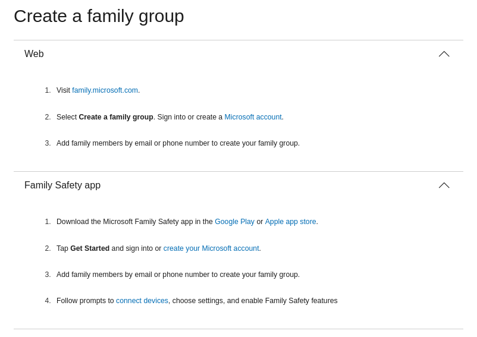
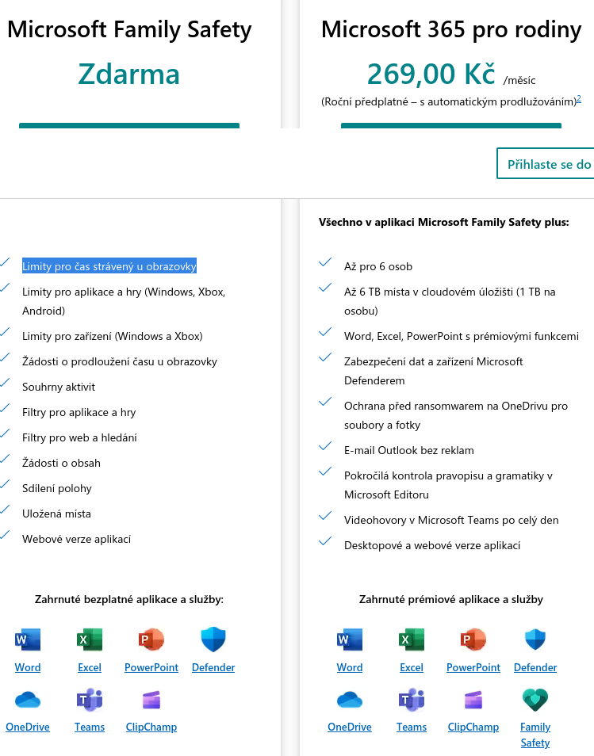
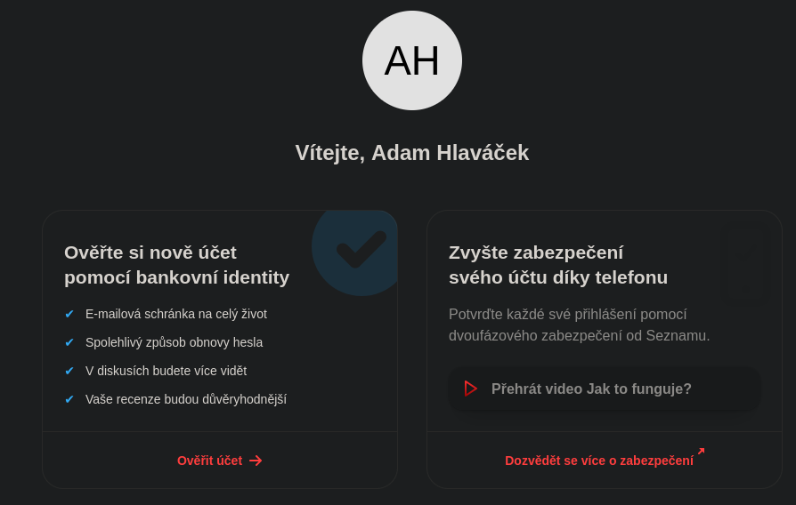

[[thesis]]
# Identity Managment for families

## Microsoft

- [Microsoft family safety docs](https://support.microsoft.com/en-us/account-billing/microsoft-family-safety-bb97220e-9dd8-4b4a-9d15-8194d5941dc5)
- 
- [Microsoft family safety sales pitch](https://www.microsoft.com/cs-cz/microsoft-365/family-safety?ocid=cmm15zkky0u&rtc=1)
  - 
  - net filtering works by blocking browsers other than Edge
  - [Phone app](https://www.microsoft.com/en-us/microsoft-365-life-hacks/privacy-and-safety/protect-your-family-how-to-select-a-phone-monitoring-app) allows for key-logging
  - payed ransomware protection & 6TB of OneDrive space
  - up to 6 accounts
  - much faster onboarding than Google (thanks to existing email?)
  - Junior can be allowed/denied to use microsoft account to login to 3rd party services
  - can set spedning limit using Microsoft money
    - https://support.microsoft.com/cs-cz/account-billing/p%C5%99id%C3%A1n%C3%AD-pen%C4%9Bz-na-%C3%BA%C4%8Det-microsoft-%C4%8Dlena-rodiny-d2a4d821-4d8b-fe19-49f1-c21d51f18aa7
  - 
- [Microsoft Entra - Secure Identities and Access | Microsoft Security](https://www.microsoft.com/en-us/security/business/microsoft-entra)
  - [Microsoft Entra Plans and Pricing | Microsoft Security](https://www.microsoft.com/en-us/security/business/microsoft-entra-pricing)
  - says free, but could not find it
  - has basic free tier that should be enough for most users
  - for some reason I see many personal details of MUNI people
  - 
  - 
  - [Přidání existujícího předplatného Azure do tenanta - Microsoft Entra | Microsoft Learn](https://learn.microsoft.com/cs-cz/azure/active-directory/fundamentals/how-subscriptions-associated-directory?amp%3Bclcid=0x5)
  - [Vytvoření bezplatného vývojářského tenanta Azure Active Directory - Microsoft Entra | Microsoft Learn](https://learn.microsoft.com/cs-cz/azure/active-directory/verifiable-credentials/how-to-create-a-free-developer-account)
- [Set up sign-up and sign-in with a Microsoft Account - Azure AD B2C | Microsoft Learn](https://learn.microsoft.com/en-us/azure/active-directory-b2c/identity-provider-microsoft-account?pivots=b2c-user-flow)
- OneDrive has ransomware protection
  - https://support.microsoft.com/en-us/windows/protect-your-pc-from-ransomware-08ed68a7-939f-726c-7e84-a72ba92c01c3
- 
- **TODO: Proklikat https://account.microsoft.com/?ref=MeControl&refd=www.microsoft365.com**
  - cena pomocí triku prodloužení?

## Google

- ~~[Identity and Access Management &nbsp;|&nbsp; IAM &nbsp;|&nbsp; Google Cloud](https://cloud.google.com/iam/)~~
  - ~~*"provided on no additional charge"*~~
  - ~~[Overview of Google identity management &nbsp;|&nbsp; Cloud Architecture Center &nbsp;|&nbsp; Google Cloud](https://cloud.google.com/architecture/identity/overview-google-authentication)~~
  - is only for access to the Cloud
- [Identity Platform &nbsp;|&nbsp; Google Cloud](https://cloud.google.com/identity-platform)
- Workpace for bussiness (expensive)
  - 6€/user/month - https://workspace.google.com/intl/cs/pricing.html
- Workspace for inviduals
  - 240CZK/month - https://workspace.google.com/intl/cs/individual/
  - has e-signature, cool
- Ransomware protection - not needed on Chrome OS
  - https://static.googleusercontent.com/media/www.google.com/cs//support/enterprise/static/gapps/docs/admin/en/gapps_workspace/How%20to%20mitigate%20ransomware%20risks%20for%20Google%20Workspace%20documents.pdf
- Drive & Mail anti-virus scan
- GSuite for families = Google One
  - https://one.google.com/faq/plan-sharing - up to 6 people
  - full Smarphone backup - https://play.google.com/store/apps/details?id=com.google.android.apps.subscriptions.red
  - payed tarrif offers advanced photo editing
  - 100GB = 50CZK/month
  - 2TB = 80CZK/month + better google meet
    - https://one.google.com/premium/workspace?hl=cs&utm_medium=web&utm_term=escape_hatch&utm_campaign=&utm_source=
  - Jaký je rozdíl mezi službou Google One a Google Workspace Individual?
    - Google Workspace Individual zahrnuje prémiové funkce jako rozpis schůzek a e‑mailový marketing, které jednotlivým vlastníkům firem pomáhají s provozem a rozšiřováním podniku. Google One je tarif pro běžné uživatele, který poskytuogole je větší úložiště ve službách Disk Google, Gmail a Fotky Google a další funkce a výhody Google.
  - Google experts - can help with recovering deleted files, ...
  - Offers VPN - https://support.google.com/googleone/answer/7582172
    - not in Czechia
- Google Families - [Google Family Group - Stay Connected with a Family Account](https://families.google/intl/en_us/families/)
  - free
- Google Family Link - https://familylink.google.com/
  - offers child account creation
  - needs to add payment card
    - child has access to a card with parent permission
  - allows location watching (Android), web restrictions
    - the restrictions can be overriden by parent PIN code
  - 
  - 
  - 

## Synnogy

- https://c2.synology.com/en-global/pricing/identity
- on prem
- free for up to 250 users and 10 devices

## Clouflare

- **[Cloudflare One](https://www.cloudflare.com/cloudflare-one/)**, [the story of](https://iframe.cloudflarestream.com/dc64ca8874298041945c9a6924c82b4b?preload=metadata)
- [Family tag on blog](https://blog.cloudflare.com/tag/families/)
  - [Overview of services for family](https://blog.cloudflare.com/shields-up-free-cloudflare-services-to-improve-your-cyber-readiness/)
- [Zero trust sales page](https://www.cloudflare.com/zero-trust/)
  - Integrates with SSO [source](https://www.cloudflare.com/learning/access-management/what-is-sso/)
    - An [identity provider (IdP)](https://www.cloudflare.com/learning/access-management/what-is-an-identity-provider/) is a service that stores and verifies user identity. IdPs are typically cloud-hosted services, and they often work with single sign-on (SSO) providers to authenticate users.
  - [Glossary](https://www.cloudflare.com/learning/security/glossary/what-is-zero-trust/)
  - [Zero trust network access learning](https://www.cloudflare.com/learning/access-management/what-is-ztna/)
    - explains ZTNA & endpoints & SDP (software defined perimeter)
  - [CF Access](https://www.cloudflare.com/zero-trust/products/access/)
    - Create an aggregation layer for secure access to all your self-hosted, SaaS, or non-web applications
    - Connect users faster and more safely than a VPN
    - Try it forever for up to 50 users with our Free plan
    - has nice video presenting all its pros
    - can use CF Warp client as an agent
- [SASE](https://www.cloudflare.com/learning/access-management/what-is-sase/)
  - _"Secure access service edge, or SASE, is a cloud-based IT model that bundles software-defined networking with network security functions and delivers them from a single service provider."_
  - components: Secure web gateways (SWG), Cloud access security broker (CASB), Zero Trust Network Access (ZTNA), [Firewall-as-a-service (FWaaS)](https://www.cloudflare.com/learning/cloud/what-is-a-cloud-firewall/)
    - [next-generation firewall (NGFW)](https://www.cloudflare.com/learning/security/what-is-next-generation-firewall-ngfw/)
      - Intrusion prevention system (IPS), Deep packet inspection (DPI), Application control (what each application can access)
- [IAM](https://www.cloudflare.com/learning/access-management/what-is-identity-and-access-management/)
  - pretty basic
  - [CASB (cloud access security broker)](https://www.cloudflare.com/learning/access-management/what-is-a-casb/)
    - Visibility - shows undocummented systems
    - Data security - provides DLP (Data loss prevention)
    - Threat protection - anti-mallware & sandboxing & URL filtering .…
    - Compliance - self explaining
- Identity sources:
  - Azure AD tennant - hard to set-up
    - [Azure AD® · Cloudflare Zero Trust docs](https://developers.cloudflare.com/cloudflare-one/identity/idp-integration/azuread/)
  - Google Project - allows any Google user to log-in
    - [Google · Cloudflare Zero Trust docs](https://developers.cloudflare.com/cloudflare-one/identity/idp-integration/google/)
  - Google Workspace - **TODO**
    - [Google Workspace - IdP · Cloudflare Zero Trust docs](https://developers.cloudflare.com/cloudflare-one/identity/idp-integration/gsuite)

### Logging in with Cloudflare

- [Question on Reddit (without answer)](https://www.reddit.com/r/selfhosted/comments/z9n8ul/using_cloudflare_tunnel_auth_with_gitea/)
- [Validate JWTs · Cloudflare Zero Trust docs](https://developers.cloudflare.com/cloudflare-one/identity/authorization-cookie/validating-json/)
  - name of the cookies, Python code
  - [Validate the Access token with FastAPI · Cloudflare Zero Trust docs](https://developers.cloudflare.com/cloudflare-one/tutorials/fastapi/)
- [Zero Trust GitLab SSH & HTTP · Cloudflare Zero Trust docs](https://developers.cloudflare.com/cloudflare-one/tutorials/gitlab/)
  - shows only access protection, not logging in
- can you SAML for NextCloud - requires click on login
  - https://medium.com/@ntrussell/enable-nextcloud-sso-authentication-through-microsoft-azure-active-directory-saml-abe37d735cd
  - [SaaS applications · Cloudflare Zero Trust docs](https://developers.cloudflare.com/cloudflare-one/applications/configure-apps/saas-apps)
  - for self-hosted applications two apps must be set-up
    - one as self hosted for access
    - second as SaaS for SAML
- gitea has no SAML yet - https://github.com/go-gitea/gitea/issues/5512
  - *to study*: [SAML vs OIDC: What’s the Real Difference? | OneLogin Blog](https://www.onelogin.com/blog/real-difference-saml-oidc)
  - maybe implement custom SAML -> OIDC server?

## Authelia

- https://www.authelia.com/
- open-source IdP
- alternative: https://www.keycloak.org/
  - has support for Kerberos, but overall difficult to configure

## Seznam

- 
- může ověřit účet pomocí bankovní identity
- používá vlastní 2FA aplikace, fallback na SMS
- [OpenID zrušeno 2015](https://www.cnews.cz/clanky/seznam-rusi-openid-lide-se-uz-naucili-pouzivat-jine-zpusoby-prihlasovani/)
- [Podporuje OAuth](https://vyvojari.seznam.cz/oauth)

## MojeID

- [hodně podporovaných služeb](https://www.mojeid.cz/cs/kde-pouzit/katalog-sluzeb/) - datová schránka, portál občana, Alza, knihovny, ....
  - dovoluje nastavit jako [zdroj OIDC](https://www.mojeid.cz/dokumentace/html/ImplementacePodporyMojeid/OpenidConnect/index.html)
- může mít úroveň záruky "vysoká", "značná" atp.

## Nextcloud

- [Box - Nextcloud](https://nextcloud.com/box/)
- může být [OIDC provider](https://apps.nextcloud.com/apps/oidc)

## Notes

- zmínit hardwarovou bezpečnost - řeší ji někdo? Používají šifrování? USB s PIN?
- krabicové offices - často už nemají updates -> nebezpečné
- [Study Reveals Average Person Has 100 Passwords | Tech.co](https://tech.co/password-managers/how-many-passwords-average-person)
- nejsou žádné zdroje na definici uživatelů kromě https://is.muni.cz/th/h7qfk/thesis.pdf

### TODO

- Vašek má Synnology disk!
- synchronizace všeho po ukradení notebooku?
  - prý umí Synnology
- tisky? WiFi?
