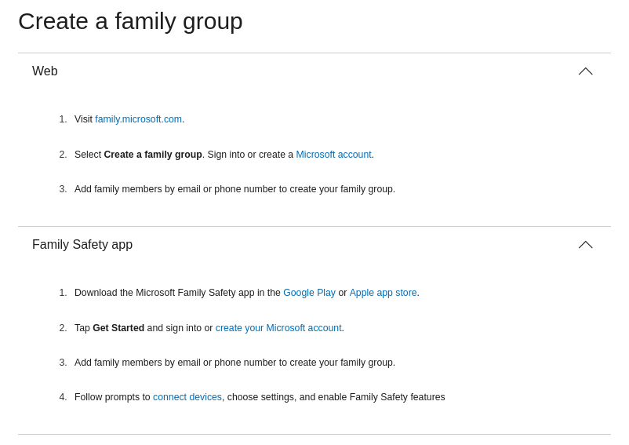

# Identity Managment for families
## Microsoft
- [Microsoft family safety docs](https://support.microsoft.com/en-us/account-billing/microsoft-family-safety-bb97220e-9dd8-4b4a-9d15-8194d5941dc5)
- 
- [Microsoft family safety sales pitch](https://www.microsoft.com/cs-cz/microsoft-365/family-safety?ocid=cmm15zkky0u&rtc=1)
    - 
    - net filtering works by blocking browsers other than Edge
    - [Phone app](https://www.microsoft.com/en-us/microsoft-365-life-hacks/privacy-and-safety/protect-your-family-how-to-select-a-phone-monitoring-app) allows for key-logging
    - payed ransomware protection & 6TB of OneDrive space
    - up to 6 accounts

## Clouflare
- **[Cloudflare One](https://www.cloudflare.com/cloudflare-one/)**, [the story of](https://iframe.cloudflarestream.com/dc64ca8874298041945c9a6924c82b4b?preload=metadata)
- [Family tag on blog](https://blog.cloudflare.com/tag/families/)
    - [Overview of services for family](https://blog.cloudflare.com/shields-up-free-cloudflare-services-to-improve-your-cyber-readiness/)
- [Zero trust sales page](https://www.cloudflare.com/zero-trust/)
    - Integrates with SSO [source](https://www.cloudflare.com/learning/access-management/what-is-sso/)
        - An [identity provider (IdP)](https://www.cloudflare.com/learning/access-management/what-is-an-identity-provider/) is a service that stores and verifies user identity. IdPs are typically cloud-hosted services, and they often work with single sign-on (SSO) providers to authenticate users.
    - [Glossary](https://www.cloudflare.com/learning/security/glossary/what-is-zero-trust/)
    - [Zero trust network access learning](https://www.cloudflare.com/learning/access-management/what-is-ztna/)
        - explains ZTNA & endpoints & SDP (software defined perimeter)
    - [CF Access](https://www.cloudflare.com/zero-trust/products/access/)
        - Create an aggregation layer for secure access to all your self-hosted, SaaS, or non-web applications
        - Connect users faster and more safely than a VPN
        - Try it forever for up to 50 users with our Free plan
        - has nice video presenting all its pros
        - can use CF Warp client as an agent
- [SASE](https://www.cloudflare.com/learning/access-management/what-is-sase/)
    - _"Secure access service edge, or SASE, is a cloud-based IT model that bundles software-defined networking with network security functions and delivers them from a single service provider."_
    - components: Secure web gateways (SWG), Cloud access security broker (CASB), Zero Trust Network Access (ZTNA), [Firewall-as-a-service (FWaaS)](https://www.cloudflare.com/learning/cloud/what-is-a-cloud-firewall/)
        - [next-generation firewall (NGFW)](https://www.cloudflare.com/learning/security/what-is-next-generation-firewall-ngfw/)
            - Intrusion prevention system (IPS), Deep packet inspection (DPI), Application control (what each application can access)
- [IAM](https://www.cloudflare.com/learning/access-management/what-is-identity-and-access-management/)
    - pretty basic
    - [CASB (cloud access security broker)](https://www.cloudflare.com/learning/access-management/what-is-a-casb/)
        - Visibility - shows undocummented systems
        - Data security - provides DLP (Data loss prevention)
        - Threat protection - anti-mallware & sandboxing & URL filtering .…
        - Compliance - self explaining